# Ansible Intro

## What is Ansible?

Ansible is a tool for configuration management, application deployment, orchestration, and many other things. It uses a declarative language to describe the desired state of the system.

## Architecture


## Flow diagram

```mermaid
sequenceDiagram
    participant Mac as 🖥️ Your Mac<br/>(Control Node)
    participant MP as 📦 Multipass
    participant WS as 🌐 Web Server
    participant DB as 🗄️ Database Server
    participant APP as ⚙️ App Server
    
    Note over Mac,APP: 1. Infrastructure Setup
    Mac->>MP: multipass launch web-server
    MP->>WS: Create VM (Ubuntu 24.04)
    Mac->>MP: multipass launch db-server  
    MP->>DB: Create VM (Ubuntu 24.04)
    Mac->>MP: multipass launch app-server
    MP->>APP: Create VM (Ubuntu 24.04)
    
    Note over Mac,APP: 2. SSH Key Distribution
    Mac->>WS: Copy SSH public key
    WS-->>Mac: SSH access established
    Mac->>DB: Copy SSH public key
    DB-->>Mac: SSH access established
    Mac->>APP: Copy SSH public key
    APP-->>Mac: SSH access established
    
    Note over Mac,APP: 3. Ansible Connectivity Test
    Mac->>WS: ansible all -m ping
    WS-->>Mac: pong ✅
    Mac->>DB: ansible all -m ping
    DB-->>Mac: pong ✅
    Mac->>APP: ansible all -m ping
    APP-->>Mac: pong ✅
    
    Note over Mac,APP: 4. Web Server Playbook
    Mac->>WS: ansible-playbook web-setup.yml
    Note over WS: Install Nginx<br/>Configure Firewall<br/>Create HTML page<br/>Start services
    WS-->>Mac: ✅ Web server ready
    
    Note over Mac,APP: 5. Database Playbook
    Mac->>DB: ansible-playbook db-setup.yml
    Note over DB: Install MySQL<br/>Set root password<br/>Create database<br/>Create user
    DB-->>Mac: ✅ Database ready
    
    Note over Mac,APP: 6. Application Playbook
    Mac->>APP: ansible-playbook app-setup.yml
    Note over APP: Install Node.js<br/>Create app user<br/>Deploy app code<br/>Install dependencies
    APP-->>Mac: ✅ App deployed
    
    Note over Mac,APP: 7. Start Application
    Mac->>APP: Start Node.js app
    APP-->>Mac: ✅ App running on port 3000
    
    Note over Mac,APP: 8. Testing Complete Infrastructure
    Mac->>WS: curl http://10.211.55.24
    WS-->>Mac: HTML page response
    Mac->>DB: Test MySQL connection
    DB-->>Mac: Database connection OK
    Mac->>APP: curl http://10.211.55.26:3000
    APP-->>Mac: JSON API response
    
    Note over Mac,APP: 🎉 Complete 3-Tier Architecture Ready!
```



## Setup 

```bash
brew install multipass 

# or you can use a VM or EC2. 
```

```bash
# control node (where we'll run Ansible)
## multipass launch --name ansible-control --cpus 2 --memory 2G --disk 20G (if you dont have ansible installed)
## i will use my mac here thought as the control node

# target nodes
# Create target nodes (your Mac will be the control node)
multipass launch --name web-server --cpus 1 --memory 1G --disk 50G
multipass launch --name db-server --cpus 1 --memory 1G --disk 5G
multipass launch --name app-server --cpus 1 --memory 1G --disk 5G

multipass list

#### SSH key setup
sh ssh-setup.sh
##################

# Get the public key
cat ~/.ssh/id_rsa.pub

#### Transfer the public key to the target nodes ####
multipass exec app-server -- bash -c 'mkdir -p /home/ubuntu/.ssh && chmod 700 /home/ubuntu/.ssh'
multipass transfer ~/.ssh/id_rsa.pub app-server:/home/ubuntu/.ssh/authorized_keys

multipass exec db-server -- bash -c 'mkdir -p /home/ubuntu/.ssh && chmod 700 /home/ubuntu/.ssh'
multipass transfer ~/.ssh/id_rsa.pub db-server:/home/ubuntu/.ssh/authorized_keys

multipass exec web-server -- bash -c 'mkdir -p /home/ubuntu/.ssh && chmod 700 /home/ubuntu/.ssh'
multipass transfer ~/.ssh/id_rsa.pub web-server:/home/ubuntu/.ssh/authorized_keys
```

## Testing

```bash
#### Connection test ####

# Test connection to all hosts
ansible all -m ping

# Test specific group
ansible webservers -m ping

#### Gather system information/facts ####

# Gather system information
ansible all -m setup

# Get specific facts
ansible all -m setup -a "filter=ansible_os_family"

# Get uptime
ansible all -m shell -a "uptime"

#### Ad-hoc commands ####

# Check disk space
ansible all -m shell -a "df -h"

# Check memory usage
ansible all -m shell -a "free -h"

# Install package
ansible all -m apt -a "name=htop state=present" --become

# Create a user
ansible all -m user -a "name=testuser state=present" --become

### test targeting specific groups
ansible webservers -m shell -a "echo 'This is the web server'"
ansible databases -m shell -a "echo 'This is the database server'"  
ansible appservers -m shell -a "echo 'This is the app server'"
```

### Individual playbooks

```bash
ansible-playbook web-setup.yml
ansible-playbook db-setup.yml
ansible-playbook app-setup.yml
```

## All plays at once

```bash
ansible-playbook site.yml
```

## Verify installation

```bash
# Check web server
curl http://<WEB_SERVER_IP>
curl http://10.211.55.24

## check DB
ssh ubuntu@10.211.55.25 "mysql -u webapp_user -pWebAppPassword123! -e 'SHOW DATABASES;'"
ansible databases -m shell -a "systemctl status mysql"
ssh ubuntu@10.211.55.22 "mysql -u root -pSecurePassword123! -e 'SHOW DATABASES;'"

## check app 
ansible appservers -m shell -a "cd /opt/myapp && sudo -u appuser nohup node app.js > app.log 2>&1 &" --become
curl http://10.211.55.26:3000

# check if services are running
ansible all -m shell -a "systemctl status nginx" --limit webservers
ansible all -m shell -a "systemctl status mysql" --limit databases
```